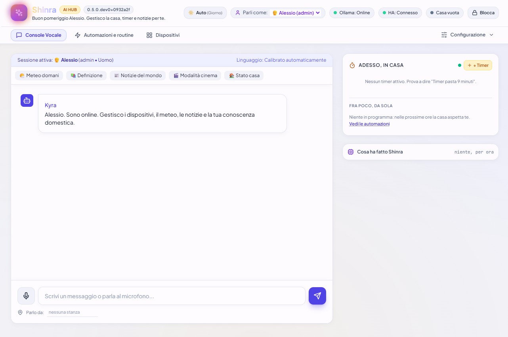

# 🏡 Shinra — Assistente Domestico Intelligente & Hub Vocale IA

**Shinra** è un hub domotico avanzato con intelligenza artificiale locale (**Ollama**) e controllo integrato di **Home Assistant**, dotato di **sintesi vocale neurale ad alta definizione (Edge-TTS)**, **editor di routine visuale a grafo 2D (stile Visio / Node-RED)**, supporto **PWA Mobile** e compatibilità nativa con **Amazon Alexa / Echo**, **Google Home** e browser web.

Il nome *Shinra* nasce dall'unione concettuale con **Shinigami** (死神 — entità che osserva e supervisiona) e rappresenta una presenza discreta, intelligente e sempre pronta a gestire l'intera casa in modo privato e sicuro.

---

## 🚧 Stato del progetto — beta `0.1.0-dev`

Shinra è in **beta** e procede per fasi verso la `1.0.0`. Ogni versione minor
corrisponde a una fase della roadmap ed è installabile e utilizzabile; fino alla
`1.0.0` una minor può introdurre modifiche incompatibili.

| Documento | Cosa contiene |
| :--- | :--- |
| [`docs/ROADMAP.md`](docs/ROADMAP.md) | Le cinque fasi da `0.1.0` a `1.0.0` e i criteri di uscita di ciascuna |
| [`docs/ARCHITECTURE.md`](docs/ARCHITECTURE.md) | Struttura attuale, struttura target e come si aggiunge un modulo nuovo |
| [`CONTRIBUTING.md`](CONTRIBUTING.md) | Flusso di lavoro, convenzioni sui commit, processo di rilascio |
| [`SECURITY.md`](SECURITY.md) | Difetti di sicurezza noti e come segnalarne di nuovi |
| [`docs/DEPLOY.md`](docs/DEPLOY.md) | Aggiornamento del server Debian e messa in sicurezza da fare subito |
| [`docs/backlog/`](docs/backlog/) | Il piano di lavoro completo, issue per issue |

> ### ⚠️ Prima della versione `0.1.0`
>
> Una revisione tecnica ha individuato difetti che chi usa oggi il progetto deve
> conoscere. I dettagli e le mitigazioni provvisorie sono in
> [`SECURITY.md`](SECURITY.md); in sintesi:
>
> - **Non esporre `/api/alexa` su Internet**: non verifica la firma Amazon e
>   accetta comandi da qualunque origine.
> - Trentotto endpoint su trentanove non richiedono autenticazione: chiunque sia
>   sulla rete di casa può comandare l'impianto.
> - ~~`config/config.yaml` è tracciato da git~~ — **risolto**: i segreti stanno
>   in `.env` (vedi `.env.example`) e i file di stato non sono più versionati.
> - **La Modalità Apprendimento non funziona** (errore 500 a ogni risposta) e i
>   **promemoria non vengono mai eseguiti**. Entrambi sono in lavorazione nella
>   milestone `v0.1.0`.

---

## 📸 Anteprima Dashboard

<p align="center">
  
</p>

---

## 🌟 Indice dei Contenuti
- [✨ Funzionalità Principali](#-funzionalità-principali)
- [🏗️ Architettura del Sistema](#️-architettura-del-sistema)
- [📦 Installazione & Configurazione su Server Linux/Debian](#-installazione--configurazione-su-server-linuxdebian)
- [🎛️ Canvas Visuale a Nodi per Routine (Visio Style)](#️-canvas-visuale-a-nodi-per-routine-visio-style)
- [⏰ Timer & Promemoria Vocali Live](#-timer--promemoria-vocali-live)
- [📱 Installazione PWA (Smartphone iOS & Android)](#-installazione-pwa-smartphone-ios--android)
- [🎙️ Motore Vocale & Voci Neurali HD](#️-motore-vocale--voci-neurali-hd)
- [📡 Guida Integrazione Amazon Alexa (Echo)](#-guida-integrazione-amazon-alexa-echo)
- [🌐 Configurazione Nginx Reverse Proxy & SSL](#-configurazione-nginx-reverse-proxy--ssl)
- [⚙️ Parametri di Configurazione (`config/config.yaml`)](#️-parametri-di-configurazione-configconfigyaml)
- [🛠️ Risoluzione Problemi (Troubleshooting)](#️-risoluzione-problemi-troubleshooting)

---

## ✨ Funzionalità Principali

### 🧠 1. Cervello IA Locale (Zero Cloud per i Dati Privati)
* Elaborazione locale tramite **Ollama** su CPU o GPU con supporto a qualsiasi modello LLM:
  * **`qwen2.5:3b`** *(Consigliato per velocità istantanea < 1s su CPU e supporto nativo ai Tool)*.
  * **`gemma2:9b`**, **`llama3.2:3b`**, **`qwen2.5:7b`**.
* **Fast-Path Istantaneo (< 0.05s)**: Risposte istantanee per meteo, notizie, orologio, timer, controllo luci e scenari senza attendere l'inferenza completa del modello quando non necessaria.

### 🏠 2. Controllo Domotico Completo (Home Assistant)
* Scoperta automatica di entità, luci, interruttori, prese, termostati, climatizzatori e sensori.
* **Mappa Dispositivi Interattiva**: Elenco dispositivi raggruppati per stanze con interruttori toggle rapidi.
* **Alias Personalizzati**: Assegna nomi naturali in linguaggio parlato (es. *"Luce scrivania"* ➔ `light.yeelight_desk`).

### 🎛️ 3. Canvas Visuale a Nodi per Routine (Stile Visio / Node-RED)
* Editor 2D a schermo intero con nodi trascinabili e cavi di collegamento Bézier interattivi:
  * ⚡ **Innesco Vocale (Trigger):** Frasi multiple di attivazione (*"Modalità Cinema"*, *"Vado a dormire"*).
  * 💡 **Dispositivo Home Assistant:** Accensione, spegnimento o regolazione di qualsiasi entità o alias.
  * ⏱️ **Ritardo Temporizzato (Pausa):** Attesa programmata tra un'azione e l'altra (es. 5s, 10s, 30s).
  * 🗣️ **Annuncio Vocale (TTS):** Risposta personalizzata di Shinra con voce neurale.
* **Simulatore con Flusso Luminoso in Tempo Reale**: I cavi si illuminano con impulsi animati per testare la sequenza visivamente prima di salvarla.

### ⏰ 4. Timer & Promemoria Vocali con Countdown Live
* Impostazione immediata a voce: *"Shinra, metti un timer di 9 minuti per la pasta"*, *"Ricordami di prendere le medicine alle 17:30"*.
* Widget dedicato nella console web con avanzamento al secondo e riproduzione di **chime sonoro elettronico + annuncio vocale** allo scadere.

### 📱 5. Progressive Web App (PWA) per Smartphone
* Web App installabile a schermo intero su iPhone (Safari ➔ *Aggiungi a Home*) e Android (*Installa App*).
* Tema scuro Cyberpunk, cache con Service Worker e pulsante di installazione rapida.

### 🎙️ 6. Motore Vocale Neurale HD (Server-Side)
* Voci neurali ultra-realistiche in streaming MP3 via **Edge-TTS**:
  * 👨 **`Diego`** (Maschile / Stile *Jarvis HD* caldo e naturale).
  * 👩 **`Elsa`** (Femminile / Stile *Shinra HD* brillante ed espressivo).
  * 👩 **`Isabella`** (Femminile dolce e conversazionale).
  * 👨 **`Giuseppe`** (Maschile formale e istituzionale).
* Fallback automatico su **Web Speech API** del browser con controlli di Pitch (tonalità) e Rate (velocità).

---

## 🏗️ Architettura del Sistema

```text
[ Browser Web / PWA Mobile ]        [ Dispositivi Amazon Echo ]
              \                                   /
               \                                 / (HTTPS /api/alexa)
                ▼                               ▼
       [ Cloudflare Edge (SSL / WAF Rule) ]
                        │
                        ▼
       [ Nginx Reverse Proxy (Port 80/443) ]
                        │
                        ▼
       [ Shinra Backend (FastAPI :8000) ]
        ├── Intent Router & Tool Agent
        ├── Timer & Reminder Engine
        ├── Edge-TTS Server Engine (MP3 Stream)
        ├── Home Assistant Connector (:8123)
        └── Ollama LLM Connector (:11434 - qwen2.5:3b)
```

---

## 📦 Installazione & Configurazione su Server Linux/Debian

### 1. Clonazione e Setup Virtualenv
```bash
cd /opt
git clone https://github.com/ShiniHouse/Shinra.git
cd Shinra

# Creazione ambiente virtuale Python 3.10+
python3 -m venv .venv
source .venv/bin/activate

# Installazione dipendenze
pip install --upgrade pip
pip install -r requirements.txt
```

### 2. Configurazione Iniziale
Copia il file di esempio e personalizza i tuoi parametri:
```bash
cp config/config.example.yaml config/config.yaml
nano config/config.yaml
```

### 3. Installazione e Download Modello Ollama
```bash
# Scarica il modello consigliato ad alta velocità
ollama pull qwen2.5:3b
```

### 4. Configurazione Servizio di Sistema (`systemd`)
Crea il file `/etc/systemd/system/shinra.service`:
```ini
[Unit]
Description=Shinra AI Smart Home Hub
After=network.target

[Service]
Type=simple
User=root
WorkingDirectory=/opt/Shinra
ExecStart=/opt/Shinra/.venv/bin/python run.py
Restart=always
RestartSec=5
Environment=PYTHONUNBUFFERED=1

[Install]
WantedBy=multi-user.target
```

Abilita e avvia il servizio:
```bash
systemctl daemon-reload
systemctl enable --now shinra
systemctl status shinra
```

---

## 📡 Guida Integrazione Amazon Alexa (Echo)

Per la guida completa dettagliata alla creazione della Skill, consulta il file dedicato: **[ALEXA_SETUP_GUIDE.md](ALEXA_SETUP_GUIDE.md)**.

### Riepilogo Rapido:
1. Accedi a **[developer.amazon.com/alexa/console/ask](https://developer.amazon.com/alexa/console/ask)** e crea una Skill Custom denominata `Shinra`.
2. Incolla l'Interaction Model da `ALEXA_SETUP_GUIDE.md` nella sezione **JSON Editor**.
3. Configura l'endpoint HTTPS: `https://tuodominio.com/api/alexa`.
4. Seleziona il certificato SSL Wildcard e clicca su **Build Model**.

---

## 🌐 Configurazione Nginx Reverse Proxy & SSL

### Esempio Configurazione Nginx / Nginx Proxy Manager:
* **Domain Name**: `tuodominio.com` o `shinra.tuodominio.com`
* **Forward IP / Hostname**: `192.168.1.100` (IP locale del server Shinra)
* **Forward Port**: `8000`
* **Block Common Exploits**: ⚠️ **Disattivare** (permette ai server di Alexa di comunicare senza falsi positivi 403).
* **SSL**: `Force SSL` attivo, `HTTP/2 Support` attivo.

```nginx
server {
    listen 443 ssl http2;
    server_name shinra.tuodominio.com;

    # Certificati SSL
    ssl_certificate /path/to/fullchain.pem;
    ssl_certificate_key /path/to/privkey.pem;

    location / {
        proxy_pass http://127.0.0.1:8000;
        proxy_set_header Host $host;
        proxy_set_header X-Real-IP $remote_addr;
        proxy_set_header X-Forwarded-For $proxy_add_x_forwarded_for;
        proxy_set_header X-Forwarded-Proto $scheme;

        proxy_read_timeout 180s;
        proxy_connect_timeout 180s;
        proxy_send_timeout 180s;
    }
}
```

### Regola Cloudflare WAF (Opzionale per Alexa):
Se usi Cloudflare come DNS/Proxy, in *Security → WAF → Custom Rules*:
* **Field**: `URI Path` equals `/api/alexa`
* **Action**: `Skip` (Salta WAF, Bot Fight Mode e controlli di sicurezza per le richieste di Alexa).

---

## ⚙️ Parametri di Configurazione (`config/config.yaml`)

```yaml
server:
  host: "0.0.0.0"
  port: 8000

assistant:
  name: "Shinra"
  default_city: "Roma"

llm:
  provider: "ollama"
  base_url: "http://localhost:11434"
  model: "qwen2.5:3b"
  temperature: 0.3
  max_tokens: 150

home_assistant:
  enabled: true
  url: "http://homeassistant.local:8123"  # oppure http://192.168.1.50:8123
  token: "INSERISCI_QUI_IL_TUO_LONG_LIVED_ACCESS_TOKEN"

voice:
  default_gender: "female"  # male / female
  neural_voice: "it-IT-ElsaNeural"
```

---

## 🛠️ Risoluzione Problemi (Troubleshooting)

| Problema | Causa Possibile | Soluzione |
| :--- | :--- | :--- |
| **Errore 524 Timeout su Cloudflare / Proxy** | Modello LLM troppo pesante per la CPU | Usa `qwen2.5:3b` o un modello quantizzato veloce per rispondere in meno di 1 secondo. |
| **Alexa: "Non posso raggiungere la skill"** | Cloudflare WAF o NPM bloccano le chiamate AWS | Disattiva *Block Common Exploits* in NPM e crea la regola di bypass WAF su Cloudflare per `/api/alexa`. |
| **Voci Web Speech robotiche** | Voci di default del browser | Seleziona le **Voci Neurali Server HD** (*Diego / Elsa*) dal selettore vocale di Shinra. |
| **Microfono non si avvia su Chrome/Safari** | Connessione HTTP non sicura | Assicurati di accedere sempre via **HTTPS** (`https://tuodominio.com`). |

---

## 📄 Licenza
Rilasciato sotto licenza MIT. Sviluppato per un'automazione domestica intelligente, elegante e 100% privata.
