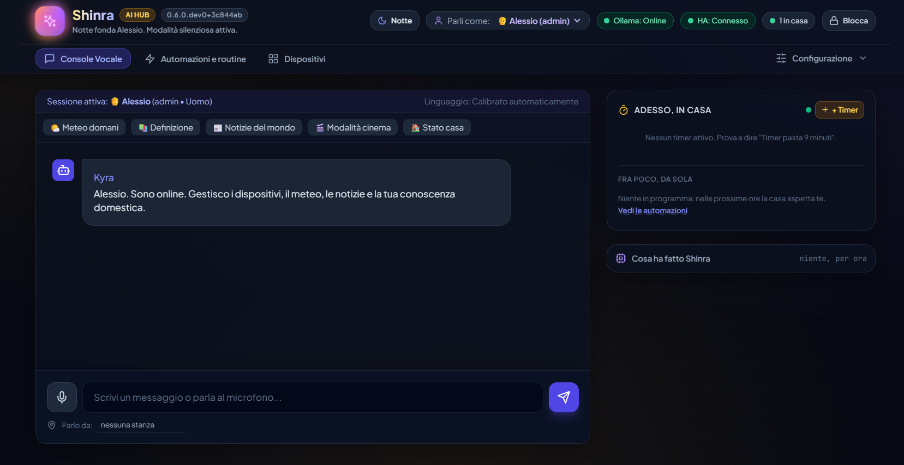
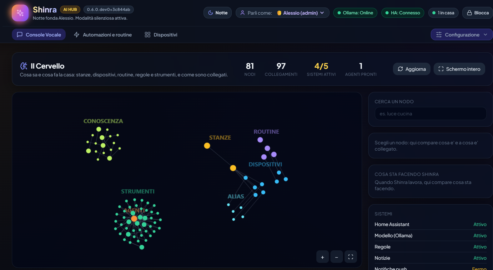
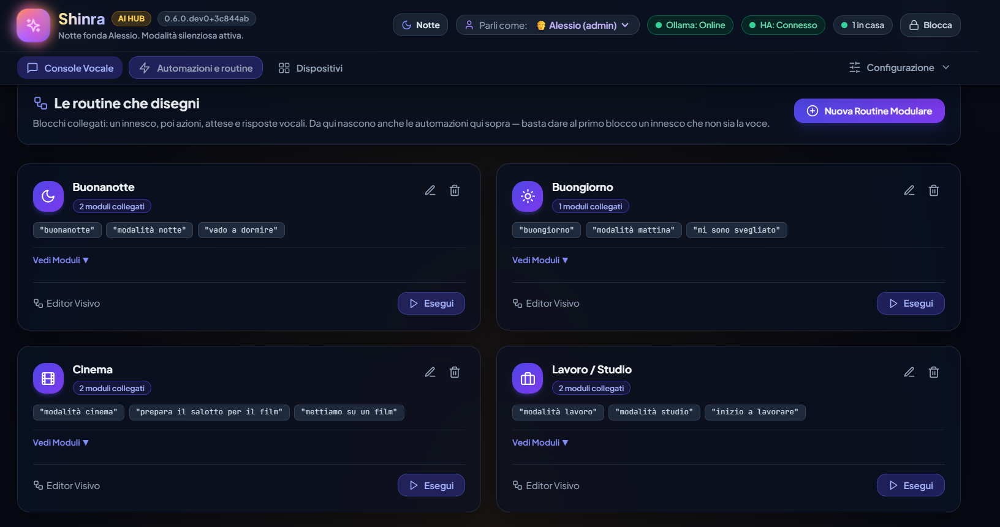

# 🏡 Shinra — Assistente Domestico Intelligente & Hub Vocale IA

**Shinra** è un hub domotico avanzato con intelligenza artificiale locale (**Ollama**) e controllo integrato di **Home Assistant**, dotato di **sintesi vocale neurale ad alta definizione (Edge-TTS)**, **editor di routine visuale a grafo 2D (stile Visio / Node-RED)**, supporto **PWA Mobile** e compatibilità nativa con **Amazon Alexa / Echo**, **Google Home** e browser web.

Il nome *Shinra* nasce dall'unione concettuale con **Shinigami** (死神 — entità che osserva e supervisiona) e rappresenta una presenza discreta, intelligente e sempre pronta a gestire l'intera casa in modo privato e sicuro.

---

## 🚧 Stato del progetto — beta, all'ultima release: la `0.5.0`

Shinra è in **beta** e procede per fasi verso la `1.0.0`. Ogni versione minor
corrisponde a una fase della roadmap ed è installabile e utilizzabile; fino
alla `1.0.0` una minor può introdurre modifiche incompatibili.

**L'ultima release è la `0.5.0`**: il prodotto. Quello che serve perché
Shinra lo installi qualcuno che non sei tu — un'interfaccia da tre ingressi,
un frontend in moduli che si può modificare senza romperlo, due lingue e una
per persona, il backup, l'immagine Docker e una documentazione che si difende
da sola. Note complete: [`docs/release/v0.5.0.md`](docs/release/v0.5.0.md).

La `0.4.0` aveva fatto smettere alla casa di aspettare la domanda: routine che
partono da sole, la voce che resta in casa, passkey e notifiche push.
Due cose quelle release **non** dichiarano risolte, e le dicono: da un Echo
l'audio va ad Amazon per costruzione, e nessuno ha ancora guardato una regola
scattare in una casa vera. Note: [`docs/release/v0.4.0.md`](docs/release/v0.4.0.md).

**Dentro la `0.5.0`:**

- **L'interfaccia rifatta** (#123–#128, #134, #139): da otto ingressi a tre,
  impostazioni a sezioni, e la colonna di destra che racconta cosa sta per
  succedere in casa invece della diagnostica.
- **Il frontend in moduli ES** (#34, chiusa): `index.html` è passato da 7.438
  righe a un'ossatura di poche righe; il markup delle schede sta in nove file inclusi, il
  JavaScript in ventitré moduli nativi con un punto d'ingresso,
  nessuno oltre le cinquecento righe (c'è una guardia); il CSS diviso per area. Nessun bundler: il codice servito è
  quello del repository ([ADR 0006](docs/adr/0006-niente-bundler.md)). Il
  markup non esegue più stringhe — nomina un gesto — e ogni valore che finisce
  nella pagina viene scappato: prima bastava un dispositivo chiamato
  `` in Home Assistant. Il server dice ai browser di
  rivalidare i moduli a ogni richiesta, così dopo un aggiornamento la pagina
  non gira con metà vecchia e metà nuova.
- **Due lingue, e una per persona** (#36, in parte): gli schemi con cui
  Shinra capisce una frase, le frasi che dice e il prompt di sistema stanno in
  un file per lingua — `italiano` e `English` — e la lingua si sceglie nel
  profilo. Due persone della stessa casa possono parlare lingue diverse.
  Aggiungere una lingua è un file, non una modifica al codice.
- **I gesti in CI** (#156): diciassette prove con un browser vero — l'editor
  a nodi, la barra, le finestre, il tema, il caricamento dei moduli — perché
  un test che legge il sorgente non sa se un clic arriva o se se lo mangia un
  antenato.
- **Lo spegnimento** (#118): il servizio si ferma in pochi secondi invece di
  aspettare il SIGKILL di systemd dopo novanta.
- **Backup e ripristino** (#35): un archivio con tutto quello che serve a
  rimettere in piedi la casa, la versione dello schema scritta dentro, la
  rotazione delle copie vecchie e un backup automatico a orario. I PIN non
  escono mai in chiaro — `scripts/esporta_json.py` li scriveva su disco.
- **La distribuzione** (#37, in parte): immagine Docker a due stadi che gira
  come utente non privilegiato, `docker-compose.yml`, e la pubblicazione su
  GHCR per `amd64` e `arm64` a ogni tag.
- **La documentazione** (#38, in parte): guida all'installazione, guida allo
  sviluppo con una ricetta che un test esegue, e un riferimento delle API
  **generato dalle rotte vere**. La CI costruisce l'immagine, la avvia e
  controlla di riuscire davvero a entrare: è così che si è scoperto che
  l'immagine partiva senza `data/examples/`, rispondeva 200 e nessuno poteva
  accedere.
- **La dashboard che dice cosa sta succedendo** (#152, #153, #159, #161): il
  canale degli eventi accetta i dispositivi fidati invece di rifiutarli dopo
  ogni riavvio, una sessione scaduta viene detta invece di ritentare in
  silenzio all'infinito, una scheda che non esiste torna alla console invece
  di lasciare la pagina vuota, e il tema si applica prima del primo disegno.
- **L'intervista che impara** (#170, in parte): quando il modello non capisce
  lo dice, invece di rispondere «Ricevuto! Ho aggiunto 1 nuovi dettagli»; e
  prima di salvare fa vedere cosa ha capito, così un'interpretazione sbagliata
  non diventa conoscenza permanente in silenzio.

**Cosa la `0.5.0` non fa, e dove è scritto.** Non c'è la parola di attivazione
(#211), non c'è l'add-on per Home Assistant OS (#282), timer e promemoria
capiscono solo l'italiano (#205), le etichette della dashboard sono solo
italiane (#206), e nessuna persona che non ha scritto le guide le ha ancora
seguite da sola (#208). Sono nella **`0.7.0`**. La `0.6.0`, *Il Cervello*, è in
lavorazione: il grafo vivo della casa e le conferme per le azioni sensibili sono
già nel codice; mancano gli agenti che si dividono il lavoro e le misure sul
modello. Il quadro completo è nella [ROADMAP](docs/ROADMAP.md), e
[qui sotto](#-dove-sta-andando) in breve.

| Documento | Cosa contiene |
| :--- | :--- |
| [`docs/INSTALLAZIONE.md`](docs/INSTALLAZIONE.md) | Docker o a mano su Debian, il token di Home Assistant, cosa sopravvive a un aggiornamento |
| [`docs/PRIMI-PASSI.md`](docs/PRIMI-PASSI.md) | Dal primo accesso alla prima automazione: profili, Home Assistant, alias, routine |
| [`docs/PROBLEMI.md`](docs/PROBLEMI.md) | Cosa fare quando qualcosa non funziona, guasto per guasto — tutti successi davvero |
| [`docs/CERVELLO.md`](docs/CERVELLO.md) | Il grafo della casa: cosa si vede, i colori, come ci si muove, cosa si accende quando Shinra lavora |
| [`docs/AGENTI.md`](docs/AGENTI.md) | Gli otto agenti di dominio, come sceglie il router, cosa succede quando sbaglia, cosa regolare |
| [`docs/CONFERME.md`](docs/CONFERME.md) | Le azioni che chiedono conferma (serrature, allarme, garage), come si risponde, cosa succede se scadono |
| [`docs/ALEXA.md`](docs/ALEXA.md) | Come configurare la skill Alexa (Interaction Model, endpoint HTTPS, test) |
| [`docs/ROADMAP.md`](docs/ROADMAP.md) | Le fasi da `0.1.0` a `1.0.0` — con la `0.7.0` e la `0.8.0` — e i criteri di uscita di ciascuna |
| [`docs/storia-delle-fasi.md`](docs/storia-delle-fasi.md) | Le schede di lavoro delle fasi chiuse (0.1.0–0.5.0): perché, cosa, com'è andata |
| [`docs/SVILUPPO.md`](docs/SVILUPPO.md) | Come si aggiunge uno strumento, un intento, una lingua, una rotta, una colonna, un'area della dashboard — e quale test ti dice cosa hai dimenticato |
| [`docs/API.md`](docs/API.md) | Le rotte HTTP e chi le può chiamare. Generato dal codice: non invecchia |
| [`docs/ARCHITECTURE.md`](docs/ARCHITECTURE.md) | Struttura attuale, struttura target e come si aggiunge un modulo nuovo |
| [`docs/DEPLOY.md`](docs/DEPLOY.md) | Aggiornamento del server Debian e cosa fare se non si riesce più a entrare |
| [`CONTRIBUTING.md`](CONTRIBUTING.md) | Flusso di lavoro, convenzioni sui commit, processo di rilascio |
| [`SECURITY.md`](SECURITY.md) | Difetti di sicurezza noti e come segnalarne di nuovi |
| [`docs/backlog/`](docs/backlog/) | Il piano di lavoro completo, issue per issue |

> ### ⚠️ Aggiornando dalla versione precedente
>
> - **L'autenticazione è attiva per difetto.** Al primo avvio, se nessun profilo
>   ha un PIN, ne viene generato uno e scritto nel log una volta sola:
>   `journalctl -u shinra --no-pager | grep "PRIMO ACCESSO"`. Se è già scorso
>   via, si reimposta con `scripts/imposta_pin.py`.
> - **L'endpoint Alexa richiede `SHINRA_ALEXA_SKILL_ID` in `.env`**: senza,
>   rifiuta ogni richiesta.
> - I segreti rimasti in `config/config.yaml` vengono spostati in `.env` al
>   primo avvio e cancellati da lì.
> - **Dalla `0.4.0` alla `0.5.0` il database si aggiorna da solo** al primo
>   avvio (una colonna nuova nei profili, la lingua): i profili restano, e
>   quella scelta vale «come la casa» finché non ne scegli un'altra. Il
>   servizio fa un backup prima, se lo aggiorni con `scripts/deploy.sh`.
> - **Dopo l'aggiornamento non serve svuotare la cache del browser**: la
>   dashboard si rivalida da sola.

---

## 📸 Anteprima Dashboard

<p align="center">
  
</p>

<p align="center"><sub><b>La console vocale.</b> Si parla o si scrive; a destra la colonna dice cosa sta per succedere in casa, non la diagnostica.</sub></p>

<p align="center">
  
</p>

<p align="center"><sub><b>Il Cervello</b> — cosa sa e cosa fa la casa, come grafo interattivo: 81 nodi e 97 collegamenti in questa casa, con lo stato di ogni sistema (Home Assistant, modello, regole, notizie). <i>Fa parte della <code>0.6.0</code>, in lavorazione: non è nella release <code>0.5.0</code>.</i></sub></p>

<p align="center">
  
</p>

<p align="center"><sub><b>Automazioni e routine.</b> Blocchi collegati — un innesco, poi azioni, attese e risposte vocali — con le frasi che le attivano e un pulsante per eseguirle.</sub></p>

<p align="center"><sub>Le schermate sono della versione di sviluppo (<code>0.6.0.dev0</code>) su una casa di prova.</sub></p>

---

## 🧭 Dove sta andando

Il traguardo è la `1.0.0`, e il cammino ha un ordine. Ogni fase è rilasciabile e si apre solo quando la precedente è finita
([ROADMAP](docs/ROADMAP.md) per i criteri di uscita).

| Fase | Tema | Cosa porta |
| :--- | :--- | :--- |
| **`0.6.0`** *(in lavorazione)* | **Il Cervello** | Il grafo vivo della casa (già nel codice), le azioni sensibili — serrature, allarme, garage — che chiedono sempre conferma (già nel codice), un banco di prova che misura quale modello sceglie lo strumento giusto, e gli agenti di dominio |
| **`0.7.0`** | **Rifinitura** | Le lingue (dashboard, timer, messaggi), un'intervista che fa una domanda per volta, la parola di attivazione, i plugin con permessi dichiarati; il modello su una macchina dedicata della rete, e piccoli aiutanti locali per il lavoro ripetitivo dello sviluppo |
| **`0.8.0`** | **Memoria viva** | Shinra ricorda — e tu vedi cosa, lo correggi, glielo fai dimenticare. La storia vecchia diventa un riassunto, di notte la casa «ci ripensa» **proponendo** (mai decidendo), e un canale di messaggistica esterno è un'opzione spenta di default |
| **`1.0.0`** | **Stabile** | Se non ci sono intoppi, subito dopo: trenta giorni di esercizio reale senza regressioni, installazione da zero verificata, nessun difetto grave aperto |

Le idee non ancora accettate stanno in [`docs/proposte/`](docs/proposte/memoria-viva/README.md) con le loro schede, e dicono
anche dove l'idea va corretta prima di costruirla.

---

## 🌟 Indice dei Contenuti
- [🧭 Dove sta andando](#-dove-sta-andando)
- [🔒 Cosa resta in casa, e cosa no](#-cosa-resta-in-casa-e-cosa-no)
- [✨ Funzionalità Principali](#-funzionalità-principali)
- [🏗️ Architettura del Sistema](#️-architettura-del-sistema)
- [🚀 Installazione](#-installazione) — e la procedura completa in [`docs/INSTALLAZIONE.md`](docs/INSTALLAZIONE.md)
- [📡 Guida Integrazione Amazon Alexa (Echo)](#-guida-integrazione-amazon-alexa-echo)
- [🌐 Configurazione Nginx Reverse Proxy & SSL](#-configurazione-nginx-reverse-proxy--ssl)
- [⚙️ Parametri di Configurazione (`config/config.yaml`)](#️-parametri-di-configurazione-configconfigyaml)
- [🛠️ Risoluzione Problemi (Troubleshooting)](#️-risoluzione-problemi-troubleshooting)

---

## 🔒 Cosa resta in casa, e cosa no

Questo elenco esisteva prima solo come slogan — *«Zero Cloud per i Dati
Privati»*, *«100% privata»* — e non era vero: fino alla `0.4.0` **ogni parola
detta al microfono della dashboard veniva inviata a Google**, perché il
riconoscimento vocale usava la Web Speech API del browser. Adesso non succede
più, e questa tabella dice esattamente come stanno le cose invece di
riassumerle in uno slogan.

| Cosa | Dove va | Nota |
| :--- | :--- | :--- |
| Il modello che risponde | **Resta in casa** | Ollama, sul tuo server |
| La conoscenza di casa e le sue ricerche | **Resta in casa** | Anche gli embedding: li calcola Ollama |
| Comandi ai dispositivi | **Resta in casa** | Home Assistant sulla tua rete |
| Anagrafica, PIN, passkey, registro delle azioni | **Resta in casa** | Sul disco del server |
| Il grafo del Cervello e gli agenti | **Resta in casa** | Si calcolano sul server; gli eventi viaggiano solo verso il tuo browser, e portano dove Shinra e' passata, non cosa hai detto |
| **La voce che parli al microfono** | **Resta in casa** *(dalla `0.4.0`)* | Whisper sul server. Vedi sotto |
| Il testo delle risposte lette a voce | **Esce** → Microsoft | Edge-TTS. Si può spegnere e usare le voci del browser |
| Meteo | **Esce** → Open-Meteo | La tua città, non chi sei |
| Notizie | **Esce** → le fonti RSS configurate | |
| Comandi detti a un Echo | **Esce** → Amazon | È un dispositivo Amazon: l'audio lo elabora Amazon, sempre |
| Notifiche push | **Esce** → Google/Mozilla/Apple | Il contenuto è **cifrato**: instradano una busta che non possono leggere |

Niente di ciò che esce porta con sé un elenco dei tuoi dispositivi, il
contenuto della tua conoscenza di casa o chi sei.

### La voce, in dettaglio

Il microfono della dashboard registra e manda l'audio al **tuo** server, che
lo trascrive con [faster-whisper](https://github.com/SYSTRAN/faster-whisper).
Non è installato per difetto — pesa, e il modello si scarica al primo uso —
quindi va aggiunto:

```bash
sudo -u shinra /opt/Shinra/.venv/bin/pip install "faster-whisper>=1.0"
sudo systemctl restart shinra
```

**Finché non lo installi il microfono della dashboard non funziona, e lo
dice.** È voluto: l'alternativa sarebbe ripiegare in silenzio sulla Web Speech
API, cioè rimettere il problema esattamente dov'era. Nel frattempo si scrive
con la tastiera, e tutto il resto funziona.

Chi preferisce la velocità del browser alla privacy può sceglierlo
esplicitamente, mettendo in `config/config.yaml`:

```yaml
voce:
  motore: browser   # l'audio esce di casa e va a Google/Apple
```

---

## ✨ Funzionalità Principali

### 🧠 1. Cervello IA Locale
* Elaborazione locale tramite **Ollama** su CPU o GPU con supporto a qualsiasi modello LLM:
  * **`qwen2.5:3b`** *(Consigliato per velocità istantanea < 1s su CPU e supporto nativo ai Tool)*.
  * **`gemma2:9b`**, **`llama3.2:3b`**, **`qwen2.5:7b`**.
* **Percorso rapido**: meteo, notizie, timer, promemoria, controllo delle luci e attivazione delle routine si riconoscono dalla frase e si eseguono senza passare dal modello; il resto va al modello, che può chiamare gli strumenti (`docs/ARCHITECTURE.md`).

### 🏠 2. Controllo Domotico Completo (Home Assistant)
* Scoperta automatica di entità, luci, interruttori, prese, termostati, climatizzatori e sensori.
* **Mappa Dispositivi Interattiva**: Elenco dispositivi raggruppati per stanze con interruttori toggle rapidi.
* **Alias Personalizzati**: Assegna nomi naturali in linguaggio parlato (es. *"Luce scrivania"* ➔ `light.yeelight_desk`).

### 🎛️ 3. Canvas Visuale a Nodi per Routine (Stile Visio / Node-RED)
* Editor 2D a schermo intero con nodi trascinabili e cavi di collegamento Bézier interattivi:
  * ⚡ **Innesco Vocale (Trigger):** Frasi multiple di attivazione (*"Modalità Cinema"*, *"Vado a dormire"*).
  * 💡 **Dispositivo Home Assistant:** Accensione, spegnimento o regolazione di qualsiasi entità o alias.
  * ⏱️ **Ritardo Temporizzato (Pausa):** Attesa programmata tra un'azione e l'altra (es. 5s, 10s, 30s).
  * 🗣️ **Annuncio Vocale (TTS):** Risposta personalizzata di Shinra con voce neurale.
  * 🔀 **Condizione:** due uscite, sì e no, sullo stato di un dispositivo, sull'orario o sulla presenza in casa.
  * 🔔 **Notifica:** un avviso push al telefono di chi deve saperlo.
* **Simulatore con Flusso Luminoso in Tempo Reale**: I cavi si illuminano con impulsi animati per testare la sequenza visivamente prima di salvarla.

### ⏰ 4. Timer & Promemoria Vocali con Countdown Live
* Impostazione immediata a voce: *"Shinra, metti un timer di 9 minuti per la pasta"*, *"Ricordami di prendere le medicine alle 17:30"*.
* Widget dedicato nella console web con avanzamento al secondo e riproduzione di **chime sonoro elettronico + annuncio vocale** allo scadere.

### 📱 5. Progressive Web App (PWA) per Smartphone
* Web App installabile a schermo intero su iPhone (Safari ➔ *Aggiungi a Home*) e Android (*Installa App*).
* Tema scuro Cyberpunk, cache con Service Worker e pulsante di installazione rapida.

### 🎙️ 6. Motore Vocale Neurale HD (Server-Side)
* Voci neurali ultra-realistiche in streaming MP3 via **Edge-TTS**:
  * 👨 **`Diego`** (Maschile / Stile *Jarvis HD* caldo e naturale).
  * 👩 **`Elsa`** (Femminile / Stile *Shinra HD* brillante ed espressivo).
  * 👩 **`Isabella`** (Femminile dolce e conversazionale).
  * 👨 **`Giuseppe`** (Maschile formale e istituzionale).
* Fallback automatico su **Web Speech API** del browser con controlli di Pitch (tonalità) e Rate (velocità).
* Il testo da leggere esce verso Microsoft: è l'ultimo servizio esterno che
  resta nel percorso vocale, e si spegne scegliendo le voci del browser.

### 🎧 7. Riconoscimento Vocale in Casa
* Il microfono della dashboard registra e manda l'audio al **tuo** server, che
  lo trascrive con **faster-whisper**. Non esce niente.
* Modello configurabile da `tiny` a `large-v3`: su una CPU di un piccolo
  server `base` è il compromesso che regge — `small` raddoppia l'attesa,
  `tiny` sbaglia i nomi propri, che in una casa sono quasi tutto.
* Le frasi che Whisper inventa sul silenzio — *«Sottotitoli e revisione a cura
  di…»* — vengono scartate invece di essere eseguite come comandi.
* Va installato a parte (`pip install faster-whisper`): vedi
  [Cosa resta in casa, e cosa no](#-cosa-resta-in-casa-e-cosa-no).

---

## 🏗️ Architettura del Sistema

```text
[ Browser Web / PWA Mobile ]        [ Dispositivi Amazon Echo ]
              \                                   /
               \                                 / (HTTPS /api/alexa)
                ▼                               ▼
       [ Reverse proxy + SSL: facoltativo in casa,    ]
       [ necessario per Alexa (vedi sotto)            ]
                        │
                        ▼
       [ Shinra Backend (FastAPI :8000) ]
        ├── Intent Router & Tool Agent
        ├── Timer & Reminder Engine
        ├── Edge-TTS Server Engine (MP3 Stream)
        ├── Home Assistant Connector (:8123)
        └── Ollama LLM Connector (:11434 - qwen2.5:3b)
```

---

## 🚀 Installazione

La strada piu' corta e' Docker:

```bash
mkdir shinra && cd shinra
curl -O https://raw.githubusercontent.com/ShiniHouse/Shinra/main/docker-compose.yml
docker compose up -d
docker compose logs shinra | grep "PRIMO ACCESSO"   # il PIN, una volta sola
docker compose exec ollama ollama pull qwen2.5:3b   # il modello, una volta sola
```

Poi la dashboard su **`http://INDIRIZZO-DEL-SERVER:8000`**.

Tutta la procedura — Docker, installazione a mano su Debian con `systemd`,
il token di Home Assistant, cosa sopravvive a un aggiornamento e perche'
l'add-on per Home Assistant OS non c'e' ancora — sta in
[`docs/INSTALLAZIONE.md`](docs/INSTALLAZIONE.md).

---

## 📡 Guida Integrazione Amazon Alexa (Echo)

Per la guida completa dettagliata alla creazione della Skill, consulta il file dedicato: **[docs/ALEXA.md](docs/ALEXA.md)**.

### Riepilogo Rapido:
1. Accedi a **[developer.amazon.com/alexa/console/ask](https://developer.amazon.com/alexa/console/ask)** e crea una Skill Custom denominata `Shinra`.
2. Incolla l'Interaction Model da `docs/ALEXA.md` nella sezione **JSON Editor**.
3. Configura l'endpoint HTTPS: `https://tuodominio.com/api/alexa`.
4. Seleziona il certificato SSL Wildcard e clicca su **Build Model**.

---

## 🌐 Configurazione Nginx Reverse Proxy & SSL

### Esempio Configurazione Nginx / Nginx Proxy Manager:
* **Domain Name**: `tuodominio.com` o `shinra.tuodominio.com`
* **Forward IP / Hostname**: `192.168.1.100` (IP locale del server Shinra)
* **Forward Port**: `8000`
* **Block Common Exploits**: **lasciare attivo**. Nelle versioni precedenti questa
  guida diceva di disattivarlo per far passare Alexa: era un consiglio sbagliato,
  perché toglieva una protezione a tutto il sito. Da `v0.1.0` l'endpoint `/api/alexa`
  verifica da sé la firma Amazon, quindi non serve abbassare nulla a monte.
  Se le chiamate di Alexa venissero comunque bloccate, restringi l'eccezione al solo
  percorso `/api/alexa` invece di disattivare il controllo ovunque.
* **SSL**: `Force SSL` attivo, `HTTP/2 Support` attivo.

```nginx
server {
    listen 443 ssl http2;
    server_name shinra.tuodominio.com;

    # Certificati SSL
    ssl_certificate /path/to/fullchain.pem;
    ssl_certificate_key /path/to/privkey.pem;

    location / {
        proxy_pass http://127.0.0.1:8000;
        proxy_set_header Host $host;
        proxy_set_header X-Real-IP $remote_addr;
        proxy_set_header X-Forwarded-For $proxy_add_x_forwarded_for;
        proxy_set_header X-Forwarded-Proto $scheme;

        proxy_read_timeout 180s;
        proxy_connect_timeout 180s;
        proxy_send_timeout 180s;
    }
}
```

### Regola Cloudflare WAF (solo se necessaria)

Da `v0.1.0` **non serve più** una regola di bypass: `/api/alexa` verifica la
firma di Amazon, l'`applicationId` della skill e l'età della richiesta, e
rifiuta tutto il resto con un `400`.

Se Cloudflare bloccasse comunque le chiamate di Amazon, in
*Security → WAF → Custom Rules* limita l'eccezione al minimo indispensabile:

* **Field**: `URI Path` equals `/api/alexa`
* **Action**: `Skip` — e **solo** le regole che stanno effettivamente bloccando,
  non l'intero WAF e non Bot Fight Mode su tutto il dominio.

---

## ⚙️ Parametri di Configurazione (`config/config.yaml`)

```yaml
server:
  host: "0.0.0.0"
  port: 8000

llm:
  ollama_url: "http://localhost:11434"   # o SHINRA_OLLAMA_URL
  model: "qwen2.5:3b"
  temperature: 0.4
  max_tokens: 150

home_assistant:
  enabled: true
  url: "http://homeassistant.local:8123" # o SHINRA_HA_URL
  # Il token NON si mette qui: va in .env come SHINRA_HA_TOKEN

assistant:
  name: "Kyra"                           # come si chiama quando le parli
  default_city: "Roma"
  language: "it"                         # con quale lingua capisce le frasi

voce:
  motore: "locale"                       # locale | browser
  modello: "base"
  lingua: "it"

security:
  auth_enabled: true

salvataggio:
  abilitato: true
  ogni_ore: 24.0
  da_conservare: 14
```

Questo è un estratto: `config/config.example.yaml` è il riferimento completo,
con il perché di ogni scelta accanto a ciascuna voce. I nomi qui sopra sono
quelli veri — `test_il_readme_documenta_chiavi_che_esistono` fallisce se uno
di loro smette di esserlo.

**I segreti non stanno in `config.yaml`.** Token, PIN amministratore e segreto
di sessione vivono in `.env` o nell'ambiente; se ne trova uno nel file di
configurazione, al primo avvio viene spostato e cancellato da lì. Il motivo è
che `config.yaml` è finito in un commit una volta, e basta una volta.

---

## 🛠️ Risoluzione Problemi (Troubleshooting)

I quattro qui sotto sono quelli che si incontrano più spesso. L'elenco
completo — un guasto per voce, tutti successi davvero, con il sintomo per
come si presenta e non per come lo si racconterebbe dopo — sta in
[`docs/PROBLEMI.md`](docs/PROBLEMI.md).

| Problema | Causa Possibile | Soluzione |
| :--- | :--- | :--- |
| **Errore 524 Timeout su Cloudflare / Proxy** | Modello LLM troppo pesante per la CPU | Usa `qwen2.5:3b` o un modello quantizzato veloce per rispondere in meno di 1 secondo. |
| **Alexa: "Non posso raggiungere la skill"** | Manca `SHINRA_ALEXA_SKILL_ID`, oppure il proxy blocca le chiamate AWS | Verifica prima il log: `journalctl -u shinra \| grep Alexa` dice il motivo esatto del rifiuto. Se manca l'App ID, impostalo in `.env`. Solo se il problema è il proxy, restringi l'eccezione al percorso `/api/alexa`. |
| **Voci Web Speech robotiche** | Voci di default del browser | Seleziona le **Voci Neurali Server HD** (*Diego / Elsa*) dal selettore vocale di Shinra. |
| **Microfono non si avvia su Chrome/Safari** | Connessione HTTP non sicura | Assicurati di accedere sempre via **HTTPS** (`https://tuodominio.com`). |

---

## 📄 Licenza
Rilasciato sotto licenza MIT. Sviluppato per un'automazione domestica
intelligente ed elegante, che tiene in casa ciò che può tenere in casa e dice
apertamente il resto: vedi [Cosa resta in casa, e cosa
no](#-cosa-resta-in-casa-e-cosa-no).
